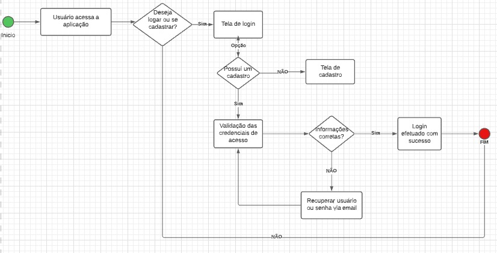
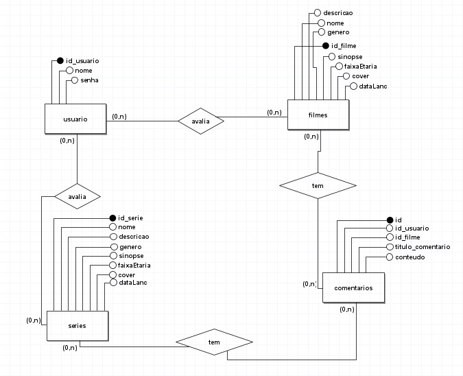
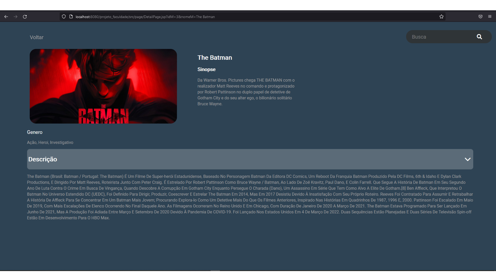
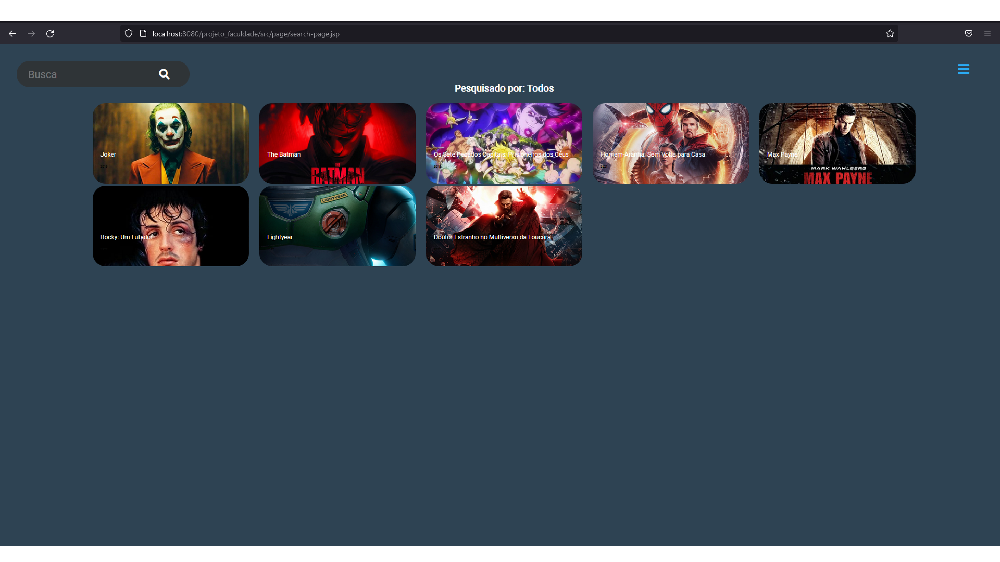
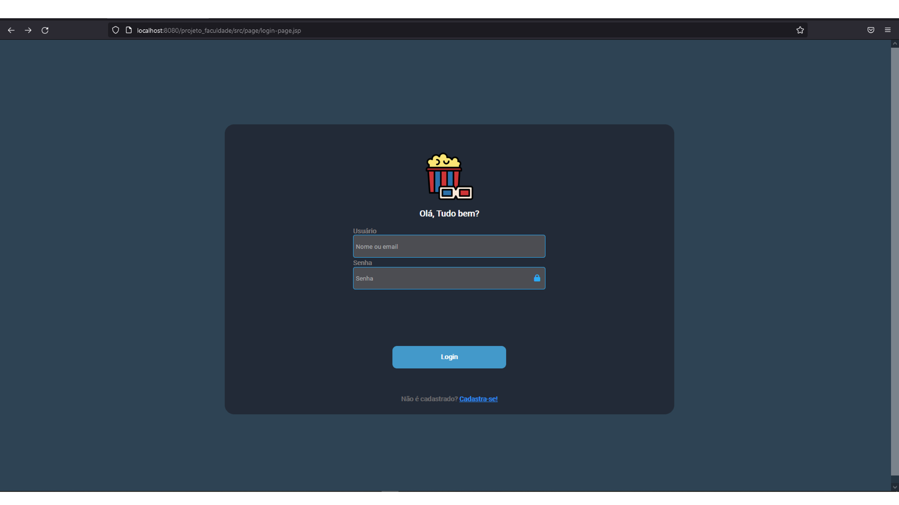

# Movie App JSP

## Descrição
Projeto de programação da faculdade na Uninove do 6° semestre.

## Bibliotecas e linguagens usadas
- JavaScript (Ajax, para requisições assíncronas)
- JDBC
- Java (JSP)
- MySQL (XAMPP)

# Fluxo de processo

# MER

# Screenshorts

#### Home page

#### Detail page

#### Search page

#### Detail page

